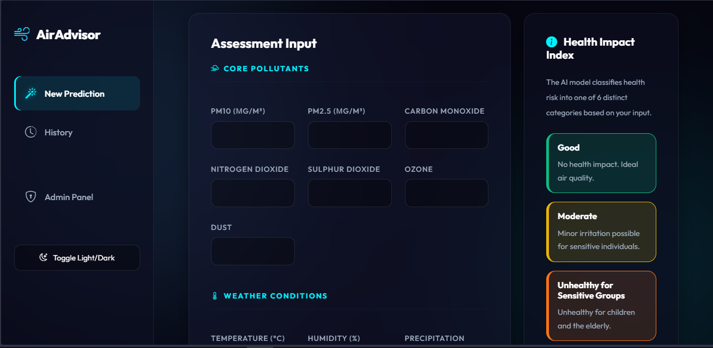
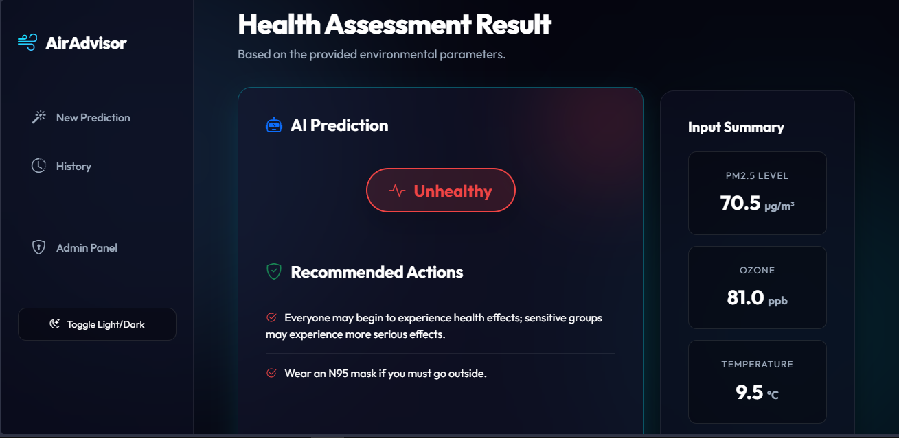
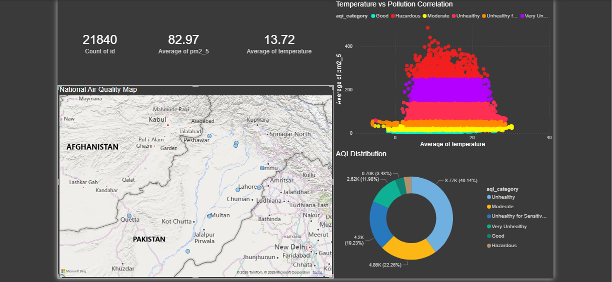
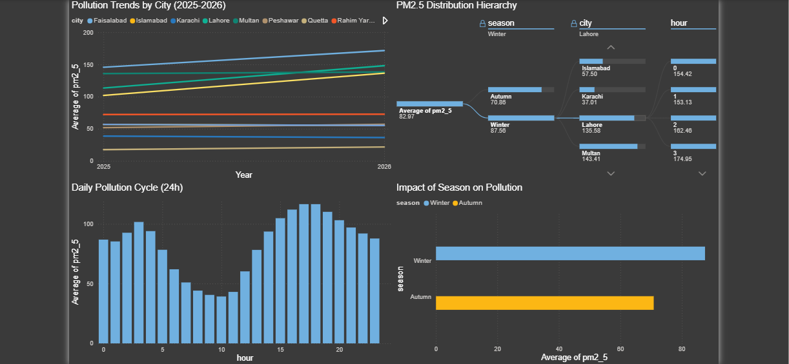

# 🌍 AirQuality Health Advisor (Pakistan Edition)

A professional, end-to-end Data Science and Web application designed to monitor, predict, and analyze air quality across Pakistan using Machine Learning and Business Intelligence.

---

## 📸 Project Gallery

| **Web Application Dashboard** | **AI Prediction Result** |
|---|---|
|  |  |

| **Power BI: National Map** | **Power BI: Temporal Trends** |
|---|---|
|  |  |

---

## 🚀 Key Features
- **Machine Learning**: Random Forest model with **99.06% Accuracy** trained on 21,000+ records.
- **Full-Stack App**: Django-based web interface with an ultra-modern **Glassmorphism UI**.
- **Real Data**: Integrated **Pakistan Air Quality Dataset** with 26 environmental features.
- **Power BI Analytics**: 4-page interactive dashboard with DAX-driven insights and AI decomposition.

---

## 🛠️ Setup Instructions

### 1. Environment Setup
```bash
git clone https://github.com/2003Talha/AirQuality-Health-Advisor.git
cd AirQuality-Health-Advisor
python -m venv venv
.\venv\Scripts\activate
```

### 2. Install Dependencies
```bash
pip install -r requirements.txt
```

### 3. Database Initialization & Data Sync
```bash
python manage.py migrate
python manage.py seed_db
```

### 4. Machine Learning Training
```bash
python research/train_model.py
```

### 5. Start Web Server
```bash
python manage.py runserver
```

---

## 📊 Power BI Connection
1. Open `analytics/AirQuality_Analysis.pbix`.
2. Go to **Transform Data** -> **Edit Parameters**.
3. Update the **`ProjectPath`** to your local folder path.
4. Click **Refresh** to see the live data from your SQLite database.

---
