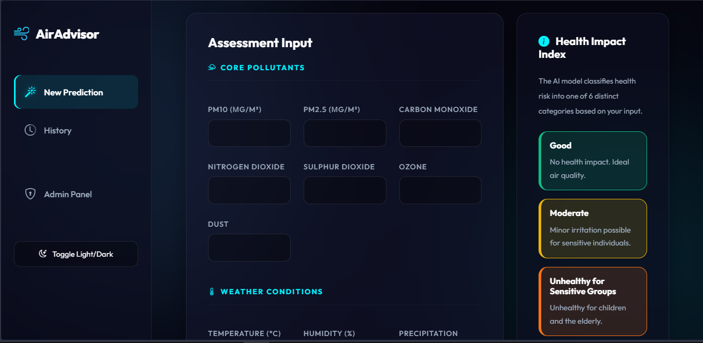
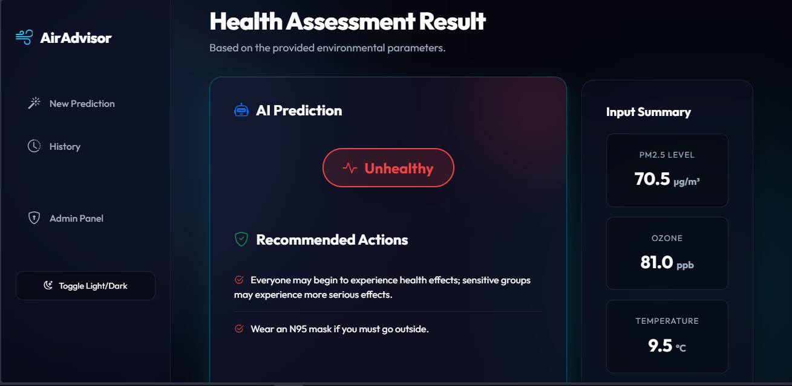
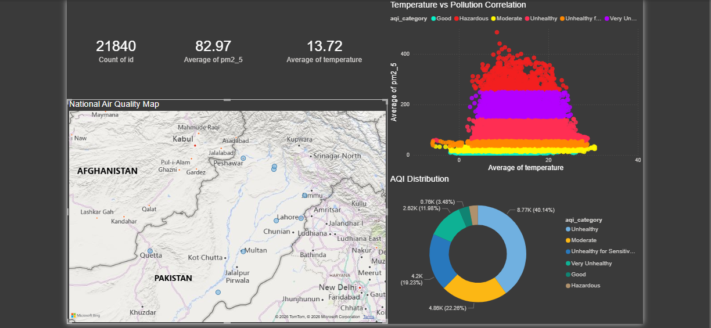
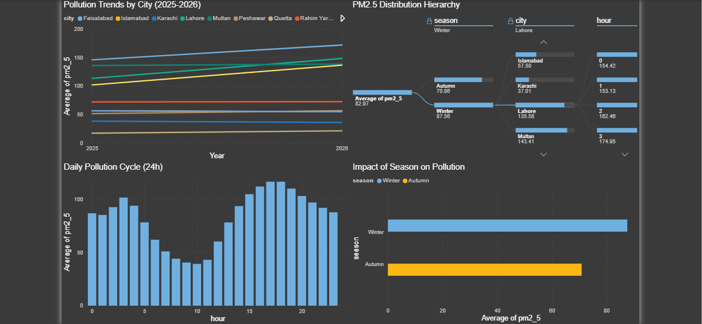

# 🌍 AirQuality Health Advisor 


A professional, end-to-end Data Science and Web application designed to monitor, predict, and analyze air quality across Pakistan using Machine Learning and Business Intelligence.

---

## 📍 Quick Links
- [📸 Project Gallery](#-project-gallery)
- [🚀 Key Features](#-key-features)
- [🛠️ Installation & Setup](#️-installation--setup)
- [📊 Power BI Suite](#-power-bi-analytical-suite)
- [🖥️ Running the App](#-running-the-app)

---

## 📸 Project Gallery

| **Web Application Dashboard** | **AI Prediction Result** |
|---|---|
|  |  |

| **Power BI: Executive Overview** | **Power BI: Temporal Trends** |
|---|---|
|  |  |

---

## 🚀 Key Features
- **🧠 Machine Learning**: Random Forest model with **99.06% Accuracy** trained on 21,000+ records.
- **💻 Full-Stack App**: Django-based web interface with an ultra-modern **Glassmorphism UI**.
- **📅 Real Data**: Integrated **Pakistan Air Quality Dataset** with 26 environmental features.
- **📉 Power BI Analytics**: 4-page interactive dashboard with DAX-driven insights and AI decomposition.

---

## 🧬 Tech Stack
- **Data Science**: Python, Scikit-learn, Pandas, NumPy, Joblib
- **Web Development**: Django, SQLite3, Bootstrap 5 (Custom CSS)
- **Business Intelligence**: Power BI Desktop, DAX, Power Query
- **Database Connectivity**: SQLite ODBC Driver (DSN-less)

---

### 📊 Power BI Analytical Suite
The project includes a comprehensive 4-page Power BI dashboard connected directly to the Django database.

| Page | Focus | Key Insights |
| :--- | :--- | :--- |
| **1. Executive Overview** | National Status | Geospatial Maps, AQI Distribution, City KPIs |
| **2. Temporal Trends** | Time Analysis | Hourly Traffic Cycles, Monthly Seasonality Trends |
| **3. Pollutant Breakdown** | Chemical Mix | Ribbon Charts, Atmospheric Wind vs. Dust Correlation |
| **4. Advanced Health Metrics** | Predictive Risk | AI Key Influencers, WHO Safety Gaps, Custom Risk Multipliers |

## 🛠️ Installation & Setup

### 1. Prerequisites
- Python 3.13+
- Power BI Desktop
- SQLite3 ODBC Driver (Required for Power BI)

> [!IMPORTANT]
> **Manual Driver Installation Required**
> The SQLite ODBC driver is essential for Power BI to communicate with the project database.
> 1. **Download**: Visit the [Official SQLite ODBC Website](http://www.ch-werner.de/sqliteodbc/).
> 2. **File**: Download **`sqliteodbc_w64.exe`** (64-bit version).
> 3. **Permissions**: You **must** run the installer as an **Administrator**.

### 2. Backend Setup

**Clone the repository:**
```bash
git clone https://github.com/MonadVoid/AirQuality-Health-Advisor.git
```

**Change Directory:**
```cmd 
cd AirQuality-Health-Advisor
```

**Create Virtual Environment:**
```bash
python -m venv venv
```

**Activate Virtual Environment (Windows):**
```powershell
venv\Scripts\activate
```

**Install dependencies:**
```bash
pip install -r requirements.txt
```
**Train ML Model:**
```bash
python research/train_model.py
```

**Setup Database:**
```bash
python manage.py makemigrations
python manage.py migrate
```

**Seed Data:**
```bash
python manage.py seed_db
```

> [!NOTE]
> The project uses **SQLite3** as a portable database. The `seed_db` command automates the **ETL process**, migrating **21,840 records** from the raw **CSV dataset** into a structured schema optimized for both Django ORM and Power BI analytical queries.

**Create Admin User:**
```bash
python manage.py createsuperuser
```

### 3. Running the App
```bash
python manage.py runserver
```

Open your web browser and go to: **[http://127.0.0.1:8000](http://127.0.0.1:8000)** to view the dashboard!

### 4. Power BI Connectivity
1. Open `analytics/AirQuality_Analysis.pbix`.
2. For data source, go to **Transform Data** -> **Edit Parameters**.
3. Update `ProjectPath` to your local folder (e.g., `C:\Projects\AirQuality-Health-Advisor`).
4. Click **Apply Changes**.
4. Click **Refresh** to see the live data from your SQLite database.

---
